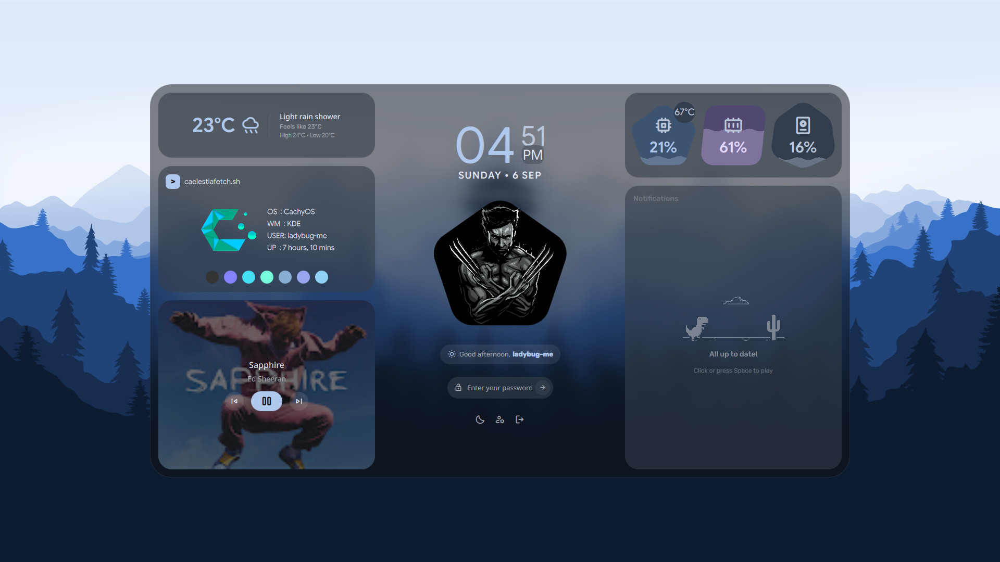

# Caelestia Lock Screen Architecture

This document outlines the architecture, component structure, design system, and developer guidelines for the native Caelestia lock screen implementation in KDE Plasma 6 / KWin.



---

## 1. Overview & Architecture

In KDE Plasma 6, `kscreenlocker_greet` manages the lock screen session and authentication. Rather than relying on third-party Wayland proxies or nested compositors, Caelestia provides a **native Plasma Shell package** (`caelestia.desktop`).

### How It Works
- **Native Shell Package:** The greeter is packaged as a `Plasma/Shell` KPackage located at `~/.local/share/plasma/shells/caelestia.desktop/`.
- **KDE Greeter Registration:** In `~/.config/plasmashellrc`, setting `[Shell]` -> `ShellPackage=caelestia.desktop` instructs `kscreenlocker_greet` to load Caelestia's lockscreen interface directly instead of the stock Plasma desktop shell.
- **Hardware-Accelerated Rendering:** Rendering is performed directly within QtQuick and KWin's compositor using hardware GPU acceleration, eliminating the CPU software-compositing bottlenecks of nested Wayland proxies.
- **Direct Authentication:** The greeter interfaces directly with KDE's ScreenLocker authentication backend (`authenticator`), providing seamless PAM authentication, error handling, grace locks, and fingerprint reader integration.

---

## 2. Component Structure

The lock screen greeter source is located in `src/kde/shells/caelestia.desktop/`:

```
src/kde/shells/caelestia.desktop/
├── metadata.json                          # KPackage manifest required by kpackagetool6 / plasmashell.
│                                          # Declares KPackageStructure=Plasma/Shell so the package is
│                                          # recognized as a greeter shell, not a plugin or applet.
└── contents/
    └── lockscreen/
        ├── LockScreen.qml                 # Main shell entry wrapper (exposes `locked` to kscreenlocker)
        ├── LockScreenUi.qml               # Root UI layout, scaling, wallpaper blur, & palette
        ├── components/
        │   ├── ClockWidget.qml            # Stacked hour/minute clock & formatted date
        │   ├── GreetingPill.qml           # Time-based greeting pill with weather/time icon
        │   ├── ProfileAvatar.qml          # ~/.face avatar with M3 pentagon clip and fallback
        │   ├── PasswordPill.qml           # Password input with animated M3 shapes & fingerprint icon
        │   ├── WeatherCard.qml            # Weather forecast, temperatures, and condition icon
        │   ├── CaelestiafetchCard.qml     # System information card with Caelestia logo & palette dots
        │   ├── MediaCard.qml              # MPRIS media player with rounded album art and playback controls
        │   ├── ResourcesCard.qml          # CPU, RAM, and Disk resource meters with live temp badge
        │   └── NotifDock.qml              # Categorized notification dock with expandable groups
        └── scripts/
            └── sysinfo.py                 # system info fetch script
```

---

## 3. Design constants

The Caelestia lock screen brings the Quickshell lock screen design into native KDE Plasma 6:

1. **Frosted-Glass Blur Textures:**
   - Because KWin Wayland does not apply compositor background blur to out-of-process greeter windows, Caelestia uses KDE's greeter wallpaper blurring technique by sourcing the in-process `wallpaper` item directly through `FastBlur` (radius 64).
   - The blurred wallpaper is mapped onto the lockscreen container (`lockBg`) and layout regions using a live `ShaderEffectSource` clipped with `OpacityMask` matching the container's corner radius (`bgRadius`).
   - Card widgets use translucent surface backgrounds (`Qt.rgba(..., 0.55)`).

2. **Concentric Corner Radii:**
   - Outer background container radius: `bgRadius = 42px` (scaled with screen height).
   - Inner container padding: `bgMargin = 16px`.
   - Card widget corner radius: `cardRadius = bgRadius - bgMargin = 26px`.

3. **Avatar Priority:**
   - [`ProfileAvatar.qml`](../../src/kde/shells/caelestia.desktop/contents/lockscreen/components/ProfileAvatar.qml) prioritizes `~/.face` directly from the user's home directory.
   - Automatically falls back to the system account picture (`kscreenlocker_userImage`) and the Material Symbols user icon if `~/.face` is absent.

4. **Responsive Layouts:**
   - **Landscape (Default):** 3-column layout (Left: Weather, Caelestiafetch, Media | Center: Clock, Avatar, Password Pill | Right: Resources, Notification Dock).
   - **Portrait:** Centered vertical column adapting automatically on vertical displays.

---

## 4. Deployment, Testing, and Uninstallation

### Deployment
The lock screen greeter is deployed automatically by the installer in Step 5 ([`scripts/02-packages.sh`](../../scripts/02-packages.sh)) and updated during shell builds ([`scripts/08-build-shell.sh`](../../scripts/08-build-shell.sh)):

```bash
# Manual installation / deployment:
mkdir -p ~/.local/share/plasma/shells/
cp -r src/kde/shells/caelestia.desktop ~/.local/share/plasma/shells/
kwriteconfig6 --file plasmashellrc --group "Shell" --key "ShellPackage" "caelestia.desktop"
```

### Interactive Testing
You can test the lock screen UI safely in a non-blocking test window without locking your desktop session:

```bash
/usr/lib/kscreenlocker_greet --testing
```

### Uninstallation & Reverting
To revert back to the stock KDE Breeze lock screen:

```bash
# Reset shell package back to KDE default
kwriteconfig6 --file plasmashellrc --group "Shell" --key "ShellPackage" --delete

# Restore default Breeze greeter theme
kwriteconfig6 --file kscreenlockerrc --group "Greeter" --key "Theme" "org.kde.breeze.desktop"

# (Optional) Remove local shell files
rm -rf ~/.local/share/plasma/shells/caelestia.desktop
```
This is also handled automatically when running [`./uninstall.sh`](../../uninstall.sh).
